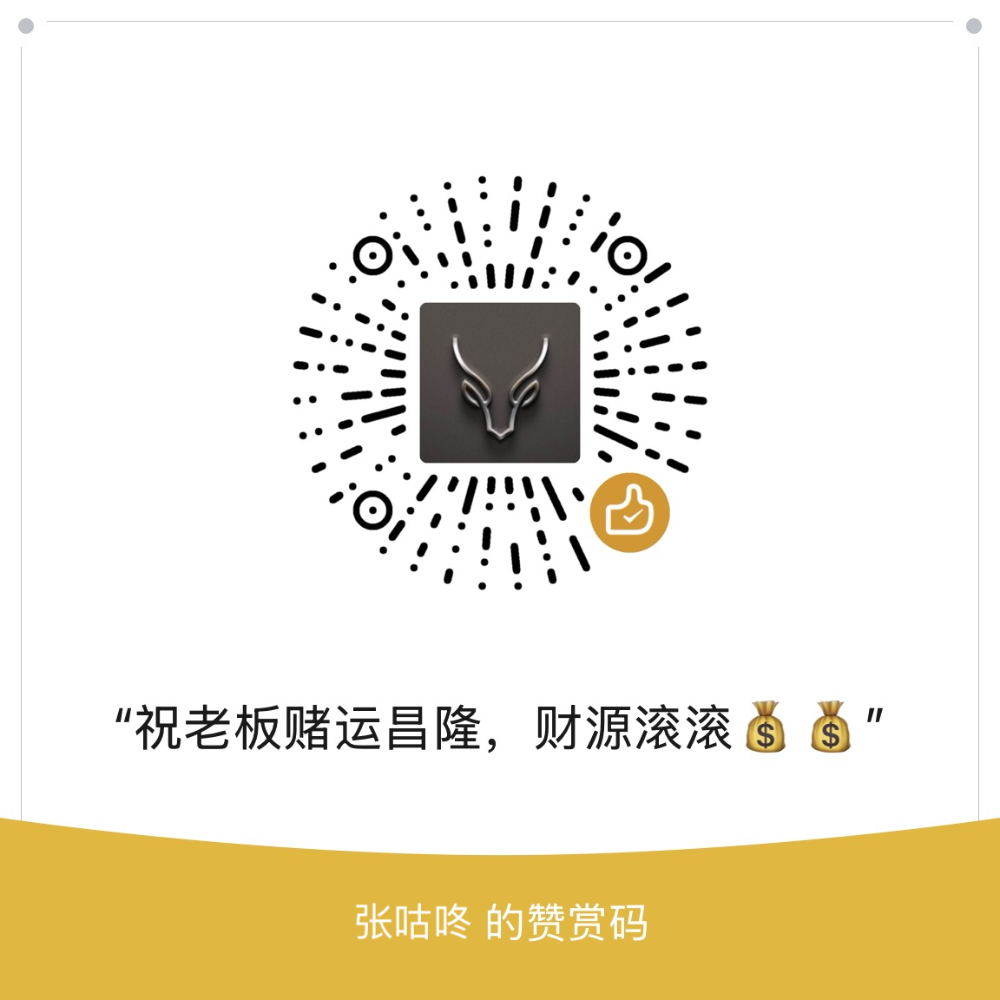

# 招行货币中间价chrome插件

> 一键查看招行汇率中间价，告别手动计算烦恼 ✨

## 功能特性

- 实时查看人民币对美元、港币等外汇的`中间价`
- 一键快速访问，无需手动计算
- 轻量级插件，不影响浏览器性能

## 为什么需要这个插件？

- 招行官网不再直接展示`中间价`，只显示`买入价`和`卖出价`
- 手动计算平均值既麻烦也并非准确，因为`中间价`并不恒等于平均值
- 🎯 本插件帮你直接获取最准确的中间价数据

## 实现原理

- 通过调用招行 API 直接获取汇率数据
- 自动解析数据，即时呈现结果

## 支持作者

如果这个工具对您有帮助，欢迎：
- ⭐️ 给项目点个 Star（您的每一个 Star 都是对我最大的鼓励！）
- 🔄 分享给更多有需要的朋友
- ☕️ 请作者喝杯咖啡

  

  
💝 点击展开/收起打赏码

  
  

## 鸣谢

- 本项目在 [Cursor](https://cursor.sh/) 的帮助下完成
- 图标来源：[Currency icons created by Pixel perfect - Flaticon](https://www.flaticon.com/free-icons/currency)
